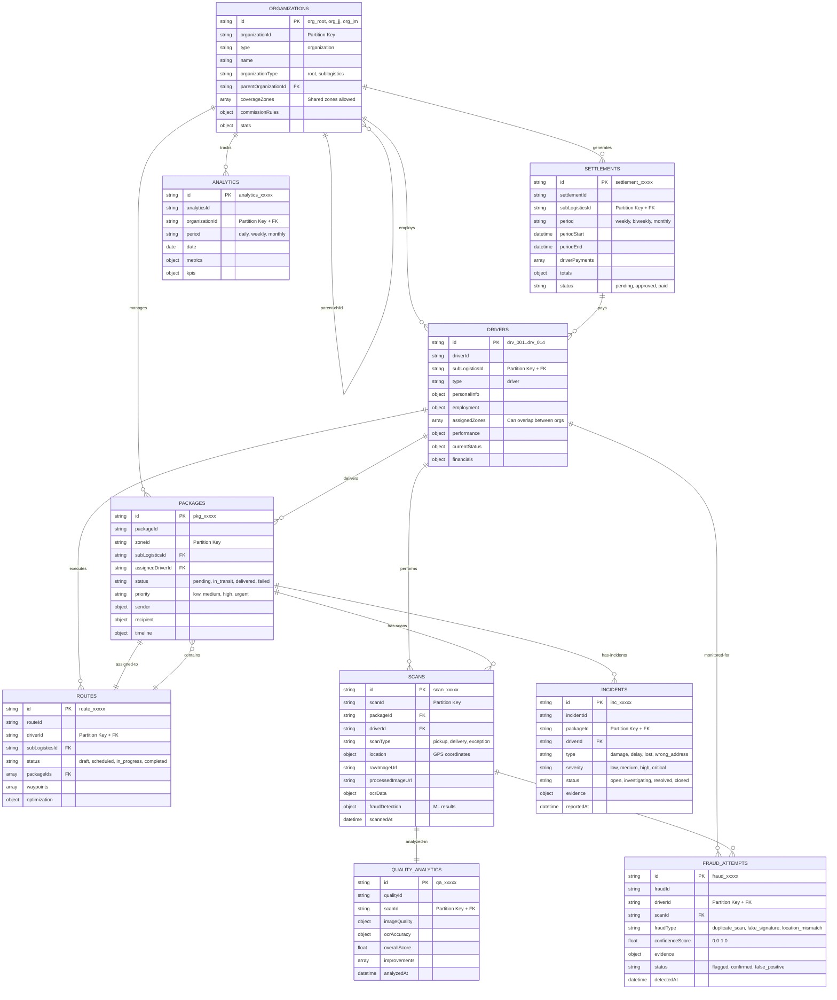

# 📊 Modelo de Datos - Sistema de Logística Integral (SLI)

**Fecha de actualización:** 2 de Noviembre, 2025
**Base de datos:** Azure Cosmos DB for NoSQL
**Database:** SLIDB
**Autenticación:** Azure AD / Managed Identity

---

## 📐 Arquitectura General

El sistema SLI utiliza **Azure Cosmos DB for NoSQL** con un modelo de datos orientado a documentos que soporta:

- ✅ Multi-tenant (empresa matriz + múltiples sublogísticas)
- ✅ Zonas geográficas compartidas entre sublogísticas
- ✅ Tracking en tiempo real de paquetes y drivers
- ✅ Detección de fraude con ML/OCR
- ✅ Analytics y reportes
- ✅ Liquidaciones automáticas

---

## 🗺️ Diagrama de Relaciones



---

## 📦 Contenedores (Collections)

### 1. ORGANIZATIONS

**Descripción:** Empresa matriz y sublogísticas
**Partition Key:** `/organizationId`
**Throughput:** 400 RU/s

#### Estructura de Documento

```json
{
  "id": "org_jj",
  "organizationId": "org_jj",
  "type": "organization",
  "name": "JJ Logística",
  "businessName": "JJ Transportes S.A.",
  "cuit": "30-71234567-8",
  "organizationType": "sublogistics",
  "parentOrganizationId": "org_root",
  "status": "active",
  "contact": {
    "email": "contacto@jjlogistica.com.ar",
    "phone": "+54 11 4567-8900",
    "address": {
      "street": "Av. Cangallo 1234",
      "city": "CABA",
      "state": "Buenos Aires",
      "zipCode": "C1234ABC",
      "country": "Argentina",
      "coordinates": {
        "lat": -34.6037,
        "lng": -58.3816
      }
    }
  },
  "configuration": {
    "coverageZones": [
      "caba", "palermo", "recoleta", "belgrano",
      "caballito", "versalles", "san_isidro",
      "olivos", "vicente_lopez", "martinez",
      "tigre", "quilmes"
    ],
    "commissionRules": {
      "perPackage": 150.00,
      "perKm": 25.00,
      "zoneBonuses": {
        "caba": 50.00,
        "palermo": 60.00
      }
    },
    "settlementPeriod": "weekly",
    "settlementDay": "monday",
    "currency": "ARS"
  },
  "stats": {
    "totalDrivers": 7,
    "totalPackagesDelivered": 0,
    "averageRating": 4.7,
    "activePackages": 0
  },
  "metadata": {
    "createdAt": "2024-03-01T00:00:00Z",
    "updatedAt": "2025-11-02T...",
    "createdBy": "admin_001",
    "tags": ["caba", "premium", "high_volume", "jj"]
  }
}
```

#### Índices Compuestos

```json
[
  { "path": "/type", "order": "ascending" },
  { "path": "/createdAt", "order": "descending" }
]
```

#### Relaciones

- **Parent → Child:** `org_root` → `org_jj`, `org_jm`
- **Organization → Drivers:** 1:N via `subLogisticsId`
- **Organization → Packages:** 1:N via `subLogisticsId`
- **Organization → Settlements:** 1:N via `subLogisticsId`

---

### 2. DRIVERS

**Descripción:** Repartidores de las sublogísticas
**Partition Key:** `/subLogisticsId`
**Throughput:** 400 RU/s

#### Estructura de Documento

```json
{
  "id": "drv_001",
  "driverId": "drv_001",
  "subLogisticsId": "org_jj",
  "type": "driver",
  "personalInfo": {
    "firstName": "Juan Carlos",
    "lastName": "Rodríguez",
    "dni": "35123456",
    "birthDate": "1990-05-15",
    "email": "jcrodriguez@email.com",
    "phone": "+54 11 5678-1234",
    "address": {
      "street": "Belgrano 2958",
      "city": "CABA",
      "state": "Buenos Aires",
      "zipCode": "C1094AAO"
    },
    "profilePhoto": "https://storage.blob.core.windows.net/drivers/drv_001.jpg"
  },
  "employment": {
    "status": "active",
    "employmentType": "contractor",
    "startDate": "2024-03-01",
    "endDate": null,
    "assignedZones": ["caba", "palermo", "belgrano"],
    "authorizedSubLogistics": ["org_jj", "org_jm"],
    "vehicleType": "motorcycle",
    "vehicleInfo": {
      "licensePlate": "ABC123",
      "brand": "Honda",
      "model": "Wave 110",
      "year": 2022,
      "insurance": {
        "company": "La Caja",
        "policyNumber": "POL-987654",
        "expiryDate": "2026-03-01"
      }
    }
  },
  "performance": {
    "totalPackagesDelivered": 1523,
    "successRate": 0.94,
    "averageDeliveryTime": 35,
    "rating": 4.6,
    "onTimeDeliveryRate": 0.89,
    "currentStreak": 47,
    "bestStreak": 102,
    "failedDeliveries": 98,
    "returnedPackages": 23
  },
  "currentStatus": {
    "status": "active",
    "lastLocation": {
      "lat": -34.5875,
      "lng": -58.3974,
      "timestamp": "2025-11-02T...",
      "accuracy": 10
    },
    "currentRoute": null,
    "packagesInTransit": 0,
    "estimatedCompletionTime": null
  },
  "financials": {
    "bankAccount": {
      "bank": "Banco Provincia",
      "cbu": "0140987654321098765432",
      "alias": "JCROD.COBROS"
    },
    "lastSettlement": null,
    "pendingAmount": 0
  },
  "metadata": {
    "createdAt": "2024-03-01T09:00:00Z",
    "updatedAt": "2025-11-02T...",
    "lastActiveAt": "2025-11-02T...",
    "appVersion": "2.3.1",
    "deviceInfo": {
      "model": "Samsung Galaxy A54",
      "os": "Android 14",
      "appBuild": "202510151"
    }
  }
}
```

#### Índices Compuestos

```json
[
  {
    "path": "/currentStatus/status",
    "order": "ascending"
  },
  {
    "path": "/performance/averageRating",
    "order": "descending"
  }
],
[
  {
    "path": "/zones/*",
    "order": "ascending"
  },
  {
    "path": "/currentStatus/status",
    "order": "ascending"
  }
]
```

#### Relaciones

- **Driver → Organization:** N:1 via `subLogisticsId`
- **Driver → Packages:** 1:N via `assignedDriverId`
- **Driver → Routes:** 1:N via `driverId`
- **Driver → Scans:** 1:N via `driverId`

---

### 3. PACKAGES

**Descripción:** Paquetes a entregar
**Partition Key:** `/zoneId`
**Throughput:** 600 RU/s (mayor throughput por ser el contenedor más consultado)

#### Estructura de Documento

```json
{
  "id": "pkg_20251102_001",
  "packageId": "pkg_20251102_001",
  "zoneId": "palermo",
  "subLogisticsId": "org_jj",
  "assignedDriverId": "drv_001",
  "status": "in_transit",
  "priority": "high",
  "sender": {
    "name": "Tienda E-commerce SA",
    "phone": "+54 11 1234-5678",
    "address": {
      "street": "Av. Santa Fe 1234",
      "city": "CABA",
      "state": "Buenos Aires",
      "zipCode": "C1059ABT",
      "coordinates": {
        "lat": -34.5956,
        "lng": -58.3816
      }
    }
  },
  "recipient": {
    "name": "María González",
    "phone": "+54 9 11 9876-5432",
    "address": {
      "street": "Thames 1500",
      "floor": "3",
      "apartment": "A",
      "city": "CABA",
      "state": "Buenos Aires",
      "zipCode": "C1414DCR",
      "coordinates": {
        "lat": -34.5892,
        "lng": -58.4378
      }
    },
    "instructions": "Tocar timbre Apto A, portero eléctrico"
  },
  "package": {
    "trackingNumber": "AR123456789JJ",
    "weight": 2.5,
    "dimensions": {
      "length": 30,
      "width": 20,
      "height": 15,
      "unit": "cm"
    },
    "description": "Producto electrónico",
    "value": 45000,
    "currency": "ARS"
  },
  "timeline": {
    "createdAt": "2025-11-02T08:00:00Z",
    "assignedAt": "2025-11-02T09:15:00Z",
    "pickedUpAt": "2025-11-02T10:30:00Z",
    "deliveredAt": null,
    "estimatedDeliveryDate": "2025-11-02T16:00:00Z"
  },
  "crossSubLogistics": {
    "enabled": false,
    "driverSubLogisticsId": null,
    "commissionPaidBy": "org_jj",
    "commissionRuleSource": "org_jj"
  },
  "scans": [],
  "incidents": [],
  "metadata": {
    "createdBy": "system",
    "tags": ["express", "fragile"]
  }
}
```

#### Índices Compuestos

```json
[
  {
    "path": "/status",
    "order": "ascending"
  },
  {
    "path": "/priority",
    "order": "descending"
  },
  {
    "path": "/estimatedDeliveryDate",
    "order": "ascending"
  }
],
[
  {
    "path": "/assignedDriverId",
    "order": "ascending"
  },
  {
    "path": "/status",
    "order": "ascending"
  }
],
[
  {
    "path": "/subLogisticsId",
    "order": "ascending"
  },
  {
    "path": "/zoneId",
    "order": "ascending"
  },
  {
    "path": "/status",
    "order": "ascending"
  }
]
```

#### Relaciones

- **Package → Organization:** N:1 via `subLogisticsId`
- **Package → Driver:** N:1 via `assignedDriverId`
- **Package → Scans:** 1:N via `packageId`
- **Package → Incidents:** 1:N via `packageId`
- **Package → Route:** N:1 via route assignment

---

### 4. ROUTES

**Descripción:** Rutas planificadas para drivers
**Partition Key:** `/driverId`
**Throughput:** 400 RU/s

#### Estructura de Documento

```json
{
  "id": "route_20251102_001",
  "routeId": "route_20251102_001",
  "driverId": "drv_001",
  "subLogisticsId": "org_jj",
  "status": "in_progress",
  "scheduledDate": "2025-11-02",
  "packageIds": [
    "pkg_20251102_001",
    "pkg_20251102_002",
    "pkg_20251102_003"
  ],
  "waypoints": [
    {
      "sequence": 1,
      "packageId": "pkg_20251102_001",
      "type": "delivery",
      "location": {
        "lat": -34.5892,
        "lng": -58.4378
      },
      "estimatedArrival": "2025-11-02T11:00:00Z",
      "actualArrival": null,
      "status": "pending"
    }
  ],
  "optimization": {
    "algorithm": "genetic",
    "totalDistance": 12.5,
    "estimatedDuration": 180,
    "fuelEstimate": 0.8
  },
  "metrics": {
    "completedStops": 0,
    "totalStops": 3,
    "onTimeDeliveries": 0,
    "delayedDeliveries": 0
  },
  "timeline": {
    "createdAt": "2025-11-02T08:00:00Z",
    "startedAt": "2025-11-02T10:00:00Z",
    "completedAt": null
  }
}
```

#### Índices Compuestos

```json
[
  {
    "path": "/status",
    "order": "ascending"
  },
  {
    "path": "/scheduledDate",
    "order": "descending"
  }
],
[
  {
    "path": "/driverId",
    "order": "ascending"
  },
  {
    "path": "/scheduledDate",
    "order": "descending"
  }
]
```

#### Relaciones

- **Route → Driver:** N:1 via `driverId`
- **Route → Packages:** 1:N via `packageIds` array

---

### 5. SCANS

**Descripción:** Escaneos de paquetes con OCR y detección de fraude
**Partition Key:** `/scanId`
**Throughput:** 400 RU/s

#### Estructura de Documento

```json
{
  "id": "scan_20251102_001",
  "scanId": "scan_20251102_001",
  "packageId": "pkg_20251102_001",
  "driverId": "drv_001",
  "scanType": "delivery",
  "location": {
    "type": "Point",
    "coordinates": [-58.4378, -34.5892],
    "accuracy": 8,
    "altitude": 25
  },
  "scannedAt": "2025-11-02T15:30:00Z",
  "rawImageUrl": "https://storage.blob.core.windows.net/scans/raw/scan_20251102_001.jpg",
  "processedImageUrl": "https://storage.blob.core.windows.net/scans/processed/scan_20251102_001.jpg",
  "ocrData": {
    "detectedText": "ENTREGADO - 02/11/2025 15:30",
    "confidence": 0.96,
    "signature": {
      "present": true,
      "matchScore": 0.89
    },
    "recipient": {
      "name": "M. González",
      "dni": "12345678"
    }
  },
  "fraudDetection": {
    "isFraudulent": false,
    "confidenceScore": 0.12,
    "flags": [],
    "mlModel": "phi4-vision-v2.1",
    "processedAt": "2025-11-02T15:30:15Z"
  },
  "imageMetadata": {
    "width": 1920,
    "height": 1080,
    "format": "jpeg",
    "sizeBytes": 245678,
    "deviceModel": "Samsung Galaxy A54"
  }
}
```

#### Índices Compuestos

```json
[
  {
    "path": "/packageId",
    "order": "ascending"
  },
  {
    "path": "/scanType",
    "order": "ascending"
  },
  {
    "path": "/scannedAt",
    "order": "descending"
  }
],
[
  {
    "path": "/driverId",
    "order": "ascending"
  },
  {
    "path": "/scannedAt",
    "order": "descending"
  }
],
[
  {
    "path": "/fraudDetection/isFraudulent",
    "order": "ascending"
  },
  {
    "path": "/fraudDetection/confidenceScore",
    "order": "descending"
  }
]
```

#### Índices Espaciales

```json
[
  {
    "path": "/location/*",
    "types": ["Point"]
  }
]
```

#### Relaciones

- **Scan → Package:** N:1 via `packageId`
- **Scan → Driver:** N:1 via `driverId`
- **Scan → Quality Analytics:** 1:1 via `scanId`
- **Scan → Fraud Attempts:** 1:N (si se detecta fraude)

---

### 6. SETTLEMENTS

**Descripción:** Liquidaciones de pago a sublogísticas
**Partition Key:** `/subLogisticsId`
**Throughput:** 400 RU/s

#### Estructura de Documento

```json
{
  "id": "settlement_2025_w44_jj",
  "settlementId": "settlement_2025_w44_jj",
  "subLogisticsId": "org_jj",
  "period": "weekly",
  "periodStart": "2025-10-28T00:00:00Z",
  "periodEnd": "2025-11-03T23:59:59Z",
  "driverPayments": [
    {
      "driverId": "drv_001",
      "driverName": "Juan Carlos Rodríguez",
      "driverSubLogisticsId": "org_jj",
      "packagesDelivered": 87,
      "packagesBreakdown": {
        "ownSubLogistics": 70,
        "crossSubLogistics": 17
      },
      "totalKm": 234.5,
      "basePayment": 13050.00,
      "kmPayment": 5862.50,
      "zoneBonuses": 4800.00,
      "crossSubLogisticsPayment": 3060.00,
      "penalties": -500.00,
      "totalPayment": 26272.50,
      "paymentBreakdown": {
        "fromOwnSubLogistics": 23212.50,
        "fromOtherSubLogistics": {
          "org_jm": 3060.00
        }
      }
    }
  ],
  "crossSubLogisticsDebts": [
    {
      "fromSubLogisticsId": "org_jm",
      "amount": 3060.00,
      "packageCount": 17,
      "status": "pending",
      "dueDate": "2025-11-10T00:00:00Z"
    }
  ],
  "totals": {
    "totalPackages": 598,
    "totalKm": 1567.8,
    "totalPayments": 159876.50,
    "totalPenalties": -3200.00,
    "netAmount": 156676.50
  },
  "status": "approved",
  "approvedBy": "admin_001",
  "approvedAt": "2025-11-04T10:00:00Z",
  "paidAt": "2025-11-04T14:30:00Z",
  "paymentReference": "TRX-2025110401234",
  "metadata": {
    "createdAt": "2025-11-04T08:00:00Z",
    "createdBy": "system_cron"
  }
}
```

#### Índices Compuestos

```json
[
  {
    "path": "/status",
    "order": "ascending"
  },
  {
    "path": "/periodEnd",
    "order": "descending"
  }
],
[
  {
    "path": "/subLogisticsId",
    "order": "ascending"
  },
  {
    "path": "/periodEnd",
    "order": "descending"
  }
]
```

#### Relaciones

- **Settlement → Organization:** N:1 via `subLogisticsId`
- **Settlement → Drivers:** 1:N via `driverPayments` array

---

### 7. INCIDENTS

**Descripción:** Incidentes reportados en entregas
**Partition Key:** `/packageId`
**Throughput:** 400 RU/s

#### Estructura de Documento

```json
{
  "id": "inc_20251102_001",
  "incidentId": "inc_20251102_001",
  "packageId": "pkg_20251102_005",
  "driverId": "drv_003",
  "type": "wrong_address",
  "severity": "medium",
  "status": "investigating",
  "description": "El destinatario se mudó hace 2 semanas. Nueva dirección: Av. Rivadavia 5678",
  "reportedBy": "drv_003",
  "reportedAt": "2025-11-02T14:20:00Z",
  "evidence": {
    "photos": [
      "https://storage.blob.core.windows.net/incidents/inc_20251102_001_photo1.jpg"
    ],
    "notes": "Vecino confirmó mudanza reciente",
    "location": {
      "lat": -34.6123,
      "lng": -58.4256
    }
  },
  "resolution": {
    "action": "redirect_to_new_address",
    "newDeliveryDate": "2025-11-03T16:00:00Z",
    "resolvedBy": null,
    "resolvedAt": null,
    "notes": null
  },
  "metadata": {
    "createdAt": "2025-11-02T14:20:00Z",
    "updatedAt": "2025-11-02T14:20:00Z"
  }
}
```

#### Índices Compuestos

```json
[
  {
    "path": "/severity",
    "order": "descending"
  },
  {
    "path": "/reportedAt",
    "order": "descending"
  }
],
[
  {
    "path": "/status",
    "order": "ascending"
  },
  {
    "path": "/reportedAt",
    "order": "descending"
  }
]
```

#### Relaciones

- **Incident → Package:** N:1 via `packageId`
- **Incident → Driver:** N:1 via `driverId`

---

### 8. ANALYTICS

**Descripción:** Métricas y KPIs agregados por organización
**Partition Key:** `/organizationId`
**Throughput:** 400 RU/s

#### Estructura de Documento

```json
{
  "id": "analytics_org_jj_20251102",
  "analyticsId": "analytics_org_jj_20251102",
  "organizationId": "org_jj",
  "period": "daily",
  "date": "2025-11-02",
  "metrics": {
    "totalPackages": 234,
    "deliveredPackages": 198,
    "failedPackages": 12,
    "pendingPackages": 24,
    "deliveryRate": 0.846,
    "averageDeliveryTime": 38,
    "onTimeDeliveryRate": 0.87
  },
  "kpis": {
    "customerSatisfaction": 4.6,
    "driverPerformance": 4.5,
    "fraudDetectionRate": 0.02,
    "incidentRate": 0.05,
    "revenue": 89765.50,
    "costs": 67234.20,
    "profit": 22531.30
  },
  "topDrivers": [
    {
      "driverId": "drv_001",
      "name": "Juan Carlos Rodríguez",
      "packagesDelivered": 45,
      "rating": 4.8
    }
  ],
  "topZones": [
    {
      "zoneId": "palermo",
      "packagesDelivered": 78,
      "revenue": 23456.00
    }
  ],
  "metadata": {
    "generatedAt": "2025-11-03T01:00:00Z",
    "generatedBy": "analytics_cron"
  }
}
```

#### Índices Compuestos

```json
[
  {
    "path": "/date",
    "order": "descending"
  },
  {
    "path": "/organizationId",
    "order": "ascending"
  }
]
```

#### Relaciones

- **Analytics → Organization:** N:1 via `organizationId`

---

### 9. FRAUD_ATTEMPTS

**Descripción:** Intentos de fraude detectados por ML
**Partition Key:** `/driverId`
**Throughput:** 400 RU/s

#### Estructura de Documento

```json
{
  "id": "fraud_20251102_001",
  "fraudId": "fraud_20251102_001",
  "driverId": "drv_007",
  "scanId": "scan_20251102_089",
  "packageId": "pkg_20251102_045",
  "fraudType": "duplicate_scan",
  "confidenceScore": 0.94,
  "detectedAt": "2025-11-02T16:45:00Z",
  "evidence": {
    "duplicateScanId": "scan_20251102_078",
    "timeDifference": 15,
    "locationMatch": true,
    "imageHash": "a1b2c3d4e5f6...",
    "mlModelOutput": {
      "model": "phi4-vision-fraud-detector",
      "version": "2.1.3",
      "rawScore": 0.9423
    }
  },
  "investigation": {
    "status": "confirmed",
    "investigatedBy": "fraud_team_001",
    "investigatedAt": "2025-11-02T18:00:00Z",
    "findings": "Driver admitió escaneo duplicado por error de app",
    "action": "warning_issued",
    "penalty": 500.00
  },
  "metadata": {
    "flaggedAt": "2025-11-02T16:45:00Z",
    "updatedAt": "2025-11-02T18:00:00Z"
  }
}
```

#### Índices Compuestos

```json
[
  {
    "path": "/detectedAt",
    "order": "descending"
  },
  {
    "path": "/confidenceScore",
    "order": "descending"
  }
],
[
  {
    "path": "/fraudType",
    "order": "ascending"
  },
  {
    "path": "/detectedAt",
    "order": "descending"
  }
]
```

#### Relaciones

- **Fraud Attempt → Driver:** N:1 via `driverId`
- **Fraud Attempt → Scan:** N:1 via `scanId`
- **Fraud Attempt → Package:** N:1 via `packageId`

---

### 10. QUALITY_ANALYTICS

**Descripción:** Análisis de calidad de escaneos OCR
**Partition Key:** `/scanId`
**Throughput:** 400 RU/s

#### Estructura de Documento

```json
{
  "id": "qa_20251102_001",
  "qualityId": "qa_20251102_001",
  "scanId": "scan_20251102_001",
  "packageId": "pkg_20251102_001",
  "driverId": "drv_001",
  "imageQuality": {
    "resolution": "1920x1080",
    "brightness": 0.78,
    "contrast": 0.82,
    "sharpness": 0.91,
    "blur": 0.05,
    "overallScore": 0.89
  },
  "ocrAccuracy": {
    "textDetectionConfidence": 0.96,
    "characterAccuracy": 0.94,
    "signatureQuality": 0.89,
    "overallScore": 0.93
  },
  "overallScore": 0.91,
  "improvements": [
    "Mejorar iluminación para escaneos nocturnos",
    "Aumentar estabilidad de cámara"
  ],
  "analyzedAt": "2025-11-02T15:30:20Z",
  "mlModel": {
    "name": "quality-analyzer-v3",
    "version": "3.2.1"
  }
}
```

#### Índices Compuestos

```json
[
  {
    "path": "/analyzedAt",
    "order": "descending"
  },
  {
    "path": "/overallScore",
    "order": "descending"
  }
]
```

#### Relaciones

- **Quality Analytics → Scan:** 1:1 via `scanId`
- **Quality Analytics → Package:** N:1 via `packageId`
- **Quality Analytics → Driver:** N:1 via `driverId`

---

## 🔗 Relaciones entre Contenedores

### Flujo Principal de Datos

```
ORGANIZATIONS (root)
    ↓
ORGANIZATIONS (sublogistics: JJ, JM)
    ↓
DRIVERS (14 total: 7 JJ + 7 JM)
    ↓
ROUTES (daily routes per driver)
    ↓
PACKAGES (assigned to zones and drivers)
    ↓
SCANS (pickup, delivery, exceptions)
    ↓
[QUALITY_ANALYTICS + FRAUD_ATTEMPTS]
    ↓
INCIDENTS (if issues occur)
    ↓
SETTLEMENTS (weekly payments)
    ↓
ANALYTICS (daily/weekly/monthly KPIs)
```

### Zonas Compartidas (Shared Zones)

**Concepto clave:** Múltiples sublogísticas pueden operar en las mismas zonas geográficas.

**Zonas Compartidas:**
- **olivos**
- **san_isidro**
- **vicente_lopez**
- **martinez**
- **tigre**
- **quilmes**

**Distribución:**
- **JJ Logística**: 12 zonas (6 exclusivas + 6 compartidas)
  - Exclusivas: `caba`, `palermo`, `recoleta`, `belgrano`, `caballito`, `versalles`
  - Compartidas: `olivos`, `san_isidro`, `vicente_lopez`, `martinez`, `tigre`, `quilmes`
- **JM Logística**: 14 zonas (8 exclusivas + 6 compartidas)
  - Exclusivas: `ramos_mejia`, `benavidez`, `gba_oeste`, `lomas_zamora`, `avellaneda`, `gba_sur`, `moron`, `ituzaingo`
  - Compartidas: `olivos`, `san_isidro`, `vicente_lopez`, `martinez`, `tigre`, `quilmes`

**Query ejemplo:**
```sql
SELECT * FROM PACKAGES p
WHERE p.zoneId = 'olivos'
AND p.subLogisticsId = 'org_jj'
```

---

## 🔄 Colaboración Cross-Sublogística (Modelo Híbrido)

### Concepto

El sistema soporta **colaboración entre sublogísticas** mediante un modelo híbrido con permisos explícitos.

**Escenario:** Un driver que pertenece a JJ Logística puede entregar paquetes de JM Logística en zonas compartidas.

### Campos Clave

#### DRIVERS - `authorizedSubLogistics`

```json
{
  "driverId": "drv_001",
  "subLogisticsId": "org_jj",  // ← Sublogística principal
  "employment": {
    "authorizedSubLogistics": ["org_jj", "org_jm"]  // ← Puede trabajar para ambas
  }
}
```

**Reglas:**
- Si `authorizedSubLogistics` contiene solo `["org_jj"]` → Driver exclusivo de JJ
- Si `authorizedSubLogistics` contiene `["org_jj", "org_jm"]` → Driver puede colaborar
- El primer elemento del array SIEMPRE es la sublogística principal
- Solo aplica en **zonas compartidas**

#### PACKAGES - `crossSubLogistics`

```json
{
  "packageId": "pkg_jm_001",
  "subLogisticsId": "org_jm",  // ← Paquete PERTENECE a JM
  "assignedDriverId": "drv_001",  // ← Asignado a driver de JJ
  "zoneId": "olivos",  // ← Zona compartida
  "crossSubLogistics": {
    "enabled": true,  // ← Colaboración activada
    "driverSubLogisticsId": "org_jj",  // ← Driver es de JJ
    "commissionPaidBy": "org_jm",  // ← JM paga la comisión
    "commissionRuleSource": "org_jm"  // ← Se usan tarifas de JM
  }
}
```

**Reglas de Negocio:**
1. `crossSubLogistics.enabled = true` → El paquete es entregado por driver de otra sublogística
2. `commissionPaidBy` → Indica quién paga (siempre la sublogística dueña del paquete)
3. `commissionRuleSource` → Qué tarifas se aplican (siempre las del dueño del paquete)

### Validación de Asignación

Cuando se asigna un paquete a un driver, el sistema valida:

```javascript
// Pseudo-código de validación
function canAssignPackage(package, driver) {
  // 1. Verificar que el driver esté en la zona del paquete
  if (!driver.employment.assignedZones.includes(package.zoneId)) {
    return false;
  }

  // 2. Si es la misma sublogística, siempre permitir
  if (package.subLogisticsId === driver.subLogisticsId) {
    return true;
  }

  // 3. Si es diferente sublogística, verificar permisos
  if (!driver.employment.authorizedSubLogistics.includes(package.subLogisticsId)) {
    return false;  // Driver no autorizado para esta sublogística
  }

  // 4. Verificar que la zona sea compartida
  const sharedZones = ["olivos", "san_isidro", "vicente_lopez", "martinez", "tigre", "quilmes"];
  if (!sharedZones.includes(package.zoneId)) {
    return false;  // Solo permitir colaboración en zonas compartidas
  }

  return true;
}
```

### Ejemplo Completo

**Driver autorizado para ambas sublogísticas:**
```json
{
  "driverId": "drv_001",
  "subLogisticsId": "org_jj",
  "employment": {
    "assignedZones": ["olivos", "san_isidro", "palermo"],
    "authorizedSubLogistics": ["org_jj", "org_jm"]
  }
}
```

**Paquete 1: De JJ (mismo sublogística)**
```json
{
  "packageId": "pkg_jj_001",
  "subLogisticsId": "org_jj",
  "assignedDriverId": "drv_001",
  "zoneId": "olivos",
  "crossSubLogistics": {
    "enabled": false,  // ← NO es colaboración
    "driverSubLogisticsId": null,
    "commissionPaidBy": "org_jj",
    "commissionRuleSource": "org_jj"
  }
}
```

**Paquete 2: De JM (colaboración cross-sublogística)**
```json
{
  "packageId": "pkg_jm_001",
  "subLogisticsId": "org_jm",
  "assignedDriverId": "drv_001",  // ← Driver de JJ entregando paquete de JM
  "zoneId": "olivos",  // ← Zona compartida
  "crossSubLogistics": {
    "enabled": true,  // ← SÍ es colaboración
    "driverSubLogisticsId": "org_jj",
    "commissionPaidBy": "org_jm",  // ← JM paga
    "commissionRuleSource": "org_jm"  // ← Tarifas de JM
  }
}
```

### Liquidaciones (Settlements)

Cuando un driver entrega paquetes de otra sublogística, el settlement se estructura así:

**Settlement de JJ (sublogística del driver):**
```json
{
  "settlementId": "settlement_2025_w44_jj",
  "subLogisticsId": "org_jj",
  "driverPayments": [
    {
      "driverId": "drv_001",
      "driverSubLogisticsId": "org_jj",
      "packagesDelivered": 87,
      "packagesBreakdown": {
        "ownSubLogistics": 70,  // ← Paquetes de JJ
        "crossSubLogistics": 17  // ← Paquetes de JM
      },
      "totalPayment": 26272.50,
      "paymentBreakdown": {
        "fromOwnSubLogistics": 23212.50,  // ← JJ paga por sus 70 paquetes
        "fromOtherSubLogistics": {
          "org_jm": 3060.00  // ← JM debe pagar por sus 17 paquetes
        }
      }
    }
  ],
  "crossSubLogisticsDebts": [
    {
      "fromSubLogisticsId": "org_jm",  // ← JM debe dinero
      "amount": 3060.00,
      "packageCount": 17,
      "status": "pending",
      "dueDate": "2025-11-10T00:00:00Z"
    }
  ],
  "totals": {
    "totalPayments": 159876.50,
    "crossSubLogisticsReceivable": 3060.00,  // ← Dinero a recibir de JM
    "netAmount": 156816.50  // ← JJ paga esto al driver, JM reembolsa después
  }
}
```

**Settlement de JM (sublogística que debe):**
```json
{
  "settlementId": "settlement_2025_w44_jm",
  "subLogisticsId": "org_jm",
  "crossSubLogisticsCredits": [
    {
      "toSubLogisticsId": "org_jj",  // ← Debe pagar a JJ
      "amount": 3060.00,
      "packageCount": 17,
      "driverIds": ["drv_001"],
      "status": "pending",
      "dueDate": "2025-11-10T00:00:00Z"
    }
  ],
  "totals": {
    "totalPayments": 145230.00,
    "crossSubLogisticsPayable": 3060.00,  // ← Dinero a pagar a JJ
    "netAmount": 148290.00  // ← Total incluyendo deuda cross-sublogística
  }
}
```

### Ventajas del Modelo Híbrido

1. **Flexibilidad:** Permite colaboración sin perder trazabilidad
2. **Control:** Permisos explícitos por driver
3. **Transparencia:** Cada paquete registra si fue colaboración
4. **Liquidaciones claras:** Breakdown detallado de pagos
5. **Escalabilidad:** Fácil agregar más sublogísticas
6. **Auditoría:** Histórico completo de colaboraciones

### Queries Cross-Sublogística

**Paquetes entregados por driver de otra sublogística:**
```sql
SELECT * FROM PACKAGES p
WHERE p.crossSubLogistics.enabled = true
AND p.crossSubLogistics.driverSubLogisticsId = 'org_jj'
```

**Drivers autorizados para colaborar:**
```sql
SELECT * FROM DRIVERS d
WHERE ARRAY_LENGTH(d.employment.authorizedSubLogistics) > 1
```

**Deudas cross-sublogística pendientes:**
```sql
SELECT * FROM SETTLEMENTS s
WHERE ARRAY_LENGTH(s.crossSubLogisticsDebts) > 0
AND s.crossSubLogisticsDebts[0].status = 'pending'
```

---

## 🔑 Estrategia de Partition Keys

### Por qué estas partition keys?

| Contenedor | Partition Key | Razón |
|------------|---------------|-------|
| **ORGANIZATIONS** | `/organizationId` | Baja cardinalidad, distribución uniforme entre org_root, org_jj, org_jm |
| **DRIVERS** | `/subLogisticsId` | Queries agrupados por sublogística, distribución 50/50 (JJ vs JM) |
| **PACKAGES** | `/zoneId` | Alta cardinalidad (20+ zonas), distribución geográfica natural |
| **ROUTES** | `/driverId` | Cada driver tiene sus propias rutas, queries por driver |
| **SCANS** | `/scanId` | Alta cardinalidad única, evita hot partitions |
| **SETTLEMENTS** | `/subLogisticsId` | Queries por sublogística, low write frequency |
| **INCIDENTS** | `/packageId` | Relación 1:1 principal con paquetes |
| **ANALYTICS** | `/organizationId` | Agregaciones por organización (root, JJ, JM) |
| **FRAUD_ATTEMPTS** | `/driverId` | Monitoreo por driver, queries de investigación |
| **QUALITY_ANALYTICS** | `/scanId` | Relación 1:1 con scans |

### Throughput Allocation

**Total:** 4,400 RU/s

- PACKAGES: **600 RU/s** (mayor throughput - contenedor más consultado)
- Resto: **400 RU/s cada uno**

**Razón:** PACKAGES tiene más operaciones de lectura/escritura por delivery lifecycle.

---

## 📊 Índices Estratégicos

### Índices Compuestos

Utilizados para queries complejos con múltiples filtros:

**Ejemplo - PACKAGES:**
```json
[
  { "path": "/status", "order": "ascending" },
  { "path": "/priority", "order": "descending" },
  { "path": "/estimatedDeliveryDate", "order": "ascending" }
]
```

**Query optimizado:**
```sql
SELECT * FROM PACKAGES p
WHERE p.status = 'in_transit'
ORDER BY p.priority DESC, p.estimatedDeliveryDate ASC
```

### Índices Espaciales

**Solo en SCANS:**
```json
{
  "path": "/location/*",
  "types": ["Point"]
}
```

**Uso:** Queries geoespaciales para tracking en tiempo real.

```sql
SELECT * FROM SCANS s
WHERE ST_DISTANCE(s.location, {
  "type": "Point",
  "coordinates": [-58.3816, -34.6037]
}) < 5000
```

---

## 🛡️ Consideraciones de Seguridad

### RBAC Permissions

- **Cosmos DB Built-in Data Contributor:** Read/Write access a datos
- **Contributor:** Required para crear databases y containers (control plane)

### Sensitive Data

**Datos sensibles en:**
- DRIVERS: `dni`, `bankAccount` (CBU)
- PACKAGES: `recipient.phone`, `sender.phone`
- SCANS: `ocrData.recipient.dni`

**Recomendación:** Implementar field-level encryption para producción.

---

## 📈 Escalabilidad

### Current Setup

- **10 contenedores**
- **4,400 RU/s total**
- **Estimated cost:** ~$30 USD/month (400 RU/s containers) + $45 (600 RU/s PACKAGES)

### Autoscaling Recommendations

Para producción, habilitar autoscaling:
```bash
az cosmosdb sql container throughput update \
  --account-name sli-cosmosdb \
  --resource-group rg-model-SLI \
  --database-name SLIDB \
  --name PACKAGES \
  --max-throughput 4000
```

---

## 🔄 Mantenimiento y Actualizaciones

### TTL (Time-To-Live)

**Recomendaciones futuras:**
- **SCANS:** TTL 90 días (archivar imágenes antiguas)
- **QUALITY_ANALYTICS:** TTL 60 días
- **FRAUD_ATTEMPTS:** No TTL (histórico de seguridad)

### Archiving Strategy

Mover datos antiguos a **Azure Blob Storage** o **Synapse Analytics** para análisis histórico:
- SCANS > 90 días
- ANALYTICS > 1 año
- INCIDENTS resueltos > 6 meses

---

## 📝 Referencias

- **Cosmos DB Best Practices:** https://learn.microsoft.com/azure/cosmos-db/nosql/best-practice-dotnet
- **Partition Key Design:** https://learn.microsoft.com/azure/cosmos-db/partitioning-overview
- **Indexing Policies:** https://learn.microsoft.com/azure/cosmos-db/index-policy

---

**Última actualización:** 2 de Noviembre, 2025
**Versión:** 1.0.0
**Mantenido por:** SLI Development Team
